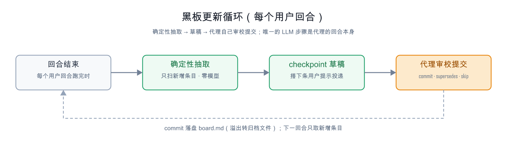
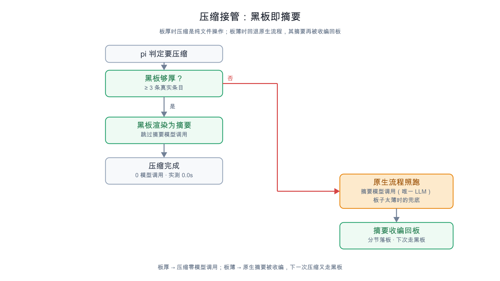

# pi-session-blackboard

> **⚠️ Experimental project — the work is not stable yet.** The core paths
> (board→summary, deterministic extraction, archive rotation) are test-covered,
> but checkpoint delivery and adoption parsing depend on real session behaviour
> and have not been exercised over long, multi-session runs. Please file an
> [issue](https://github.com/LittleSatellite233/pi-session-blackboard/issues) if
> you find a problem.

**In one line**: pi's compaction summary becomes a **file render** instead of a
model call — the session's blackboard
(`~/.pi/agent/blackboard/<sessionId>.md`), maintained continuously, *is* the fact
record kept at compaction. Compaction no longer drops facts, and no longer costs
a summarization-model call.

## What problem this solves

pi's native compaction calls a summarization model to squeeze history into a
paragraph when context runs out. Two costs:

1. **Expensive**: on a local model (W4A16 27B over PCIe) this is the single most
   expensive call in the pipeline — it did not finish within the 40s probe
   window (same-machine comparison below);
2. **Lossy**: a model summary drops exact facts — file paths, function names,
   error text — which are exactly what you need to keep working after compaction.

This extension does not bring "a better summarization model". It **changes the
information source**: the facts are already in the session. After every
completed user turn, a pure-TypeScript deterministic extraction (milliseconds,
zero models) drafts the new entries; the **agent itself** reviews and commits
them on its next turn; the result is a plain markdown file. When compaction
fires, the board is rendered directly as the summary — pi's cut-point
algorithm, the `keepRecentTokens` retained tail, and the compaction entry are
all untouched; **only the summary content changes, and the summarization call
is skipped**.

## Architecture at a glance



Three moving parts:

1. **Extraction — deterministic, per-turn.** Pure TypeScript over the *new*
   session entries (vcc-style pattern matching): goal/scope, prefs, files +
   exported symbols, git commits, `[ERROR]` lines, decisions/next.
   Millisecond-scale, no network, nothing to tune.
2. **Curation — the agent, in its own turn.** The draft rides on your *next*
   prompt as a hidden message (`display: false`, zero extra API calls). The
   agent reviews, corrects, and commits survivors via the `blackboard` tool —
   or skips the draft if it is noise.
3. **Archival — mechanical.** Per-section overflow rotates deterministically
   into append-only archive files; every commit also mirrors a compact digest
   into the session JSONL (`sbb-snapshot` entries), searchable by
   `blackboard_recall`.

Nothing here ever launches a background model. The only LLM work is the agent's
own curation — which is the part that needs semantics: regex cannot tell
"this decision is dead" from "this decision is current", but the agent can.

## Install

```bash
pi install /path/to/pi-session-blackboard   # user-level; or pi install -l ... for project scope
# restart pi (extensions load at process start)
```

Remove with `pi remove npm:pi-session-blackboard` (or the installed name shown
by `pi list`).

Note: in `settings.json` `packages`, reference this package with a **bare
string** path — `"extensions": []` disables *all* of the package's extensions
(empty array = explicit disable, not "no filtering"). After installing, check
`pi list` for a `(filtered)` marker.

## Compaction: the board IS the summary



When compaction fires (manual `/compact`, context threshold, overflow
recovery), the handler returns:

```
{ compaction: { summary: <board rendered in pi's native section shape>,
                firstKeptEntryId, tokensBefore } }
```

- **pi's summarization model call is skipped, not duplicated** — the summary
  is the curated board the agent has been reviewing every `checkpointTurns`
  turns;
- the rest of native compaction is untouched: the cut-point algorithm, the
  `keepRecentTokens` retained tail, the compaction entry, the projection
  rebuild;
- sections are rendered in pi's own summary shape (`## Goal`,
  `## Constraints & Preferences`, `## Key Decisions`, `## Files & Changes`,
  `## Open Issues`, `## Next Steps`), plus a footer with the board file path
  and the `blackboard_recall` retrieval guidance;
- **the footer is reserved before truncation**: when the board exceeds
  `summaryMaxChars`, the oldest body lines are dropped — never the retrieval
  instructions;
- **floor**: fewer than 3 real entries → `null` → pi's native flow runs. A thin
  board must not become a thin summary;
- read or render failures also fall back to native.

Measured on the same local 27B (W4A16/PCIe): board path **0.0s**; native
summarization path did not finish (>3min). The board is a file — compaction is
a file render.

### Adoption: the native summary is not wasted

When the board is thin, the native flow ran — the model already paid its call,
and that summary should not be thrown away. Adoption parses it back into the
board:

- **`session_start`**: the session restores from an existing summary while the
  board is thin → seed the board from that summary;
- **`session_compact`**: after a native compaction, the new summary is parsed
  into per-section entries and committed to the board — the *next* compaction
  then goes through the board;
- **self-adoption loop guard** (three layers): the `fromExtension` guard
  (compactions produced by board mode never trigger adoption) + the
  own-summary marker (`BOARD_SUMMARY_MARKER`) + a board-not-thin check — the
  board's own render can never be parsed back into itself;
- parsing rules: **section-title routing** (`## Goal` /
  `## Constraints & Preferences` / `[Files And Changes]` all recognized) +
  **content sniffing over titles** (a line containing `ENOENT` under
  `## Progress` lands in Issues); placeholders are dropped (`[Scope change]`,
  `[x]`); per-entry quota is 600 chars (not bound by the agent's 300-char cap);
- each section keeps the latest 6 adopted entries; the rest goes into a single
  archive file `adopted-<stamp>.md` plus one pointer line (no more 206
  per-entry fragment files).

End-to-end measured: a 14578-char native summary → 31 entries adopted + 1
adoption archive; 8160 chars → 27 entries.

### Retrieval: `blackboard_recall`

Once the summary *is* the board, the model needs a way past it.
`blackboard_recall` greps, case-insensitively, for literal substrings:

1. the live board (`boardDir/<sessionId>.md`), each hit attributed to its
   `## Section`;
2. the rotated archive (`boardDir/archive/<sessionId>/*.md`);
3. the `sbb-snapshot` digests mirrored into the session JSONL.

Queries are **literal substrings copied out of the conversation** (paths,
function names, error fragments) — not natural-language questions. Digests are
walked field by field: a snapshot hit is the single board line that matched,
attributed to its section (`recentFiles` reports as `Files`) and stamped with
when it was mirrored. Numbers and the `counts` object are skipped — matching a
count is noise, not a fact. Output is a compact card, newest last, hard-capped
(`limit`, default 20, max 60). `full: true` restores the old whole-digest dump
for when you want a board state, not a fact.

**Every hit is one line plus its locator**, never a blob:

```
- [board · Decisions] - [2026-10-02 14:46] thin board auto-falls back to native: < 3 real entries → null …
- [archive/board-…0005.md · From: Goal] - [2026-10-02 14:46] …first board-routed compaction not yet verified
- [snapshot/2291@07-11-24 · Goal] mainline: …board is still accumulating, first board-routed compaction unverified
```

## Board sections

| section | holds | written by |
|---|---|---|
| `Goal` | the session's opening task; `[Scope change]` only when the leading user text genuinely changes direction | extraction + agent review |
| `Constraints & Preferences` | "always/never/prefer/please use…" statements (deduped against the board) | extraction + agent review |
| `Key Decisions` | assistant "I'll use X / decided to / let's go with…" lines; **decisions must state the reason and the rejected alternative** | agent review primarily |
| `Files & Changes` | `MODIFIED <path> (symbol1, symbol2)` (successful edit/write) + `COMMIT <hash> <subject>` (successful git commit) | deterministic extraction |
| `Open Issues` | `[ERROR] <cmd>: <first error line>` (failed shell); auto-marked `[RESOLVED <ts>]` when the referenced file is modified | extraction + agent review |
| `Findings` | **experiment conclusions and data** — whenever the user asks for an experiment, the conclusion and its data must be recorded (the experiment reminder is auto-extracted) | agent review |
| `Next Steps` | "next step / TODO / after this" lines | agent review |
| `Archived` | rotation pointers; extension-managed, not writable by the agent | the extension |

Entries are single lines, auto-timestamped, deduped, capped at 300 chars each.
The `##` sections are fixed; unknown sections and stray lines you add by hand
are preserved verbatim across extension writes.

**Facts change; the board must not keep both versions.** `commit` only dedupes
on an exact match, so correcting a line without `supersedes` leaves the stale
one next to it. `supersedes` carries a unique substring of the entry being
replaced: the old line is archived in the same call into
`archive/<sessionId>/board-<ts>.md` (still greppable via `blackboard_recall`), a
pointer lands in `## Archived`, and the new line is the only version the
compaction summary can show.

```jsonc
{ "action": "commit", "entries": [
  { "section": "next", "text": "board has 22 entries, next compaction uses it",
    "supersedes": "starts empty, need 3 entries" }
]}
```

## The curation loop in practice

1. You work. After each completed turn, the extension mines the *new* session
   entries:

   - **goal** — the session's opening task (once), then `[Scope change]`
     markers only (vcc patterns);
   - **prefs** — "always/never/prefer/please use…" statements (vcc patterns,
     deduped against the board);
   - **files** — `MODIFIED <path> (symbols)` from successful `edit`/`write`
     tool calls, exported symbols extracted deterministically from the new
     code (from tool arguments — zero heuristics);
   - **files** — `COMMIT <hash> <subject>` from successful `git commit` runs;
   - **issues** — `[ERROR] <cmd>: <first error line>` from failed shell
     commands (exit codes, tsc/pytest/panic/traceback patterns);
   - **findings** — experiment conclusions and data (paired with the
     experiment reminder);
   - **decisions / next** — assistant "I'll use / decided / next step" lines
     (capped and clipped; the agent fixes them at review).

   If an open issue references a file that just got edited, it is marked
   `[RESOLVED <ts>]` automatically.

2. When a checkpoint is due (default **every turn**; `checkpointTurns: 3` is
   the quieter recommended cadence), the next user prompt carries a hidden
   message (draft + review instructions). The agent commits survivors — or
   skips. The TUI stays clean; `/bb` inspects any time.

3. If the agent ignores the draft three times in a row, injection stops and a
   warning appears in the TUI (`/bb` still shows everything, `/bb skip` clears).

## The `blackboard` tool

| action | what it does |
|---|---|
| `commit` | records `entries=[{section, text, supersedes?}]` (one line each, auto-timestamped, deduped, capped at 300 chars). Section overflow rotates into the archive file. |
| `commit` + `supersedes` | on one entry: a unique substring of the board entry **it replaces**. The stale line is archived in the same call, so the summary can never carry both versions of a changed fact. Ambiguous or missing targets are reported back (the new line still lands) — retry with a longer substring, or use `archive`. |
| `skip` | discards the pending draft. |
| `show` | prints the current board (truncated in the tool result; full file on disk). |
| `archive` | moves a single stale entry (unique `target` substring) into the archive file, with a pointer left in `## Archived`. |

## `/bb` command

| form | what it does |
|---|---|
| `/bb` | status (path, version, per-section counts, turns since checkpoint, pending draft) + board (truncated to 80 lines) |
| `/bb now` | force the pending-draft checkpoint immediately (or with your next message, per `delivery`) |
| `/bb skip` | discard the pending draft |
| `/bb reset` | confirm, then delete this session's board + state (archive files are kept) |

## Files

What lands where — **you never manage any of it**. The board is written only by
the `blackboard` tool, and only when the agent commits:

| file | written by | what it holds |
|---|---|---|
| `~/.pi/agent/blackboard/<sessionId>.md` | the `blackboard` tool (on the agent's commit) | **the board** — plain markdown, stable section order, capped per section |
| `~/.pi/agent/blackboard/archive/<sessionId>/board-<ts>.md` | the `blackboard` tool (deterministic overflow rotation) | per-section overflow — append-only, one file per rotation |
| `~/.pi/agent/blackboard/archive/<sessionId>/adopted-<stamp>.md` | adoption (`session_start` / `session_compact`) | adopted entries beyond the 6-per-section quota — one file + one pointer line on the board |
| `~/.pi/agent/blackboard/state/<sessionId>.json` | the extension (deterministic) | extraction cursor, pending draft, counters |
| `~/.pi/agent/blackboard/debug/<sessionId>.ndjson` | the extension, only when `"debugLog": true` | event log for debugging |
| the session's own JSONL (`sbb-snapshot` entries) | the extension (optional mirroring) | compact digests of board state — searchable by `blackboard_recall` |

The board is a file — if you want a copy, it's right there. State, drafts,
mirrors, and digests **never enter the model's context** — they are files and
JSONL custom entries, greppable and commit-able, and the board is readable with
the normal `read` tool (e.g. after compaction).

## Configuration

`~/.pi/agent/settings.json` (user) or `.pi/settings.json` (project, wins),
under the key `"session-blackboard"`:

```jsonc
{
  "session-blackboard": {
    "enabled": true,              // master switch
    "checkpointTurns": 1,         // review cadence in user turns (1 = every turn)
    "delivery": "next-turn",      // "next-turn" (0 extra LLM calls) | "immediate" (steer turn now)
    "maxEntriesPerSection": 40,   // rotation threshold per section
    "maxEntryChars": 300,         // per-entry line cap
    "maxDraftLines": 60,          // draft size cap rendered into the checkpoint
    "mirrorToSession": true,      // compact digest → session JSONL (sbb-snapshot entries)
    "compaction": "board",        // "board" (the board IS the summary) | "digest" | "off"
    "summaryMaxChars": 6000,      // hard cap for the board rendered as the summary
    "compactAssist": false,       // legacy: native LLM summary + appended board section
    "compactAssistMaxChars": 4000, // hard cap for the assist section appended to summaries
    "boardDir": "~/.pi/agent/blackboard",  // absolute, or relative to the agent dir
    "debugLog": false
  }
}
```

- **`checkpointTurns`** defaults to 1 ("extract and let the agent review every
  turn"). If the per-turn curation is noisy, raise it to 3–10 — extraction and
  `[RESOLVED]` marking still happen every turn; only the review cadence
  changes.
- **`delivery: "next-turn"`** (default) injects the checkpoint with your next
  message: zero extra LLM calls. `"immediate"` dispatches a steer message that
  triggers a short review turn right away (small extra call, mostly cached
  prefix) — useful in unattended runs where "next user message" is far away.

### Legacy: compaction assist (`compactAssist`, off by default)

**Assist, don't replace.** When pi's native compaction runs (manual `/compact`,
context threshold, or overflow recovery), the handler invokes the *same*
exported `compact()` the harness would call (identical model, prompt, retained
tail, `customInstructions`) and **appends a size-capped deterministic board
section** (goal ≤3, open issues ≤5, files ≤5, next ≤3, per-section stats, plus a
pointer to the full board file and archive dir) to the LLM summary.
*Every red branch — any gate, or the call itself throwing — returns
`undefined`: the untouched native flow runs (the harness's own call, retry
policy, retained tail). The only addition is the capped deterministic section
appended to the native LLM summary: zero extra LLM cost.*

Superseded by `"compaction": "board"`, which needs no summarization call at
all.

### Session-JSONL mirroring (`mirrorToSession`)

On every commit (and pre-compaction in `digest` mode) a **compact digest**
(goal ≤3, next ≤3, recent files ≤5, open-issue count, per-section counts) is
appended as an `sbb-snapshot` custom entry. Custom entries do not enter LLM
context, so this costs nothing at inference time; it exists purely so the
board's state is *persisted inside the session record* — searchable forever by
`blackboard_recall`, and an input to any future deterministic summary.

## Cost model (what this does NOT do)

| workload | this extension |
|---|---|
| background LLM calls | **none, ever** |
| extra prefills | none (extraction is CPU-only) |
| prompt overhead | the checkpoint message at review time only (~1–3k tokens, appended at tail — prefix cache intact) |
| archival | deterministic file rotation (append-only) |
| compaction | `"board"` returns the board as the summary and skips pi's summarization call (thin board → native flow); cut point and retained tail stay pi's; legacy `compactAssist` (off) appends a capped section to the native LLM summary; opt-in `digest` mirroring |

## Compatibility

- pi ≥ 0.84 (tested against the extension API of 0.84.x: `agent_settled`,
  `before_agent_start`, `session_before_compact`, `session_compact`,
  `pi.registerTool`, `pi.registerCommand`, `pi.appendEntry`, `pi.sendMessage`).
- Zero runtime dependencies (imports only `node:*`, `typebox`, and
  `@earendil-works/pi-coding-agent` — all resolved by pi's extension loader).
- In pi's `settings.json` `packages`, reference this package with a **bare
  string** path (`"../../pi-session-blackboard"`). Writing
  `{"path": "...", "extensions": []}` disables *all* of the package's
  extensions (an empty array explicitly disables all resources) — it is not
  "no filtering". Check with `pi list` for a `(filtered)` marker.
- TypeScript, strict; `npm install && npm run typecheck` for the dev loop.

## Development

```bash
npm install            # devDependencies only; the extension itself has no runtime deps
npm run typecheck      # tsc --noEmit
npm test               # build (tsc -> build/) + node test/smoke.mjs
npm run docs:render    # SVG -> PNG (resvg, deterministic, no browser)
```

`tsconfig.json` is the portable config. `tsconfig.check.json` /
`tsconfig.build.json` are machine-local helpers (they map `@earendil-works/*`
and `typebox` to an existing install so the sources can be checked without
`npm install`) and are git-ignored on purpose.

The pure functions (board→summary rendering, recall search, adoption parsing,
the legacy assist section) are asserted by `test/smoke.mjs` (32 checks); the
hooks, the checkpoint injection, and the compaction hand-back are exercised by
real pi sessions, not by the suite.

## Limitations (honest)

- "Forced" means **prompt-enforced + periodic nudge**, not a hard guarantee:
  a model can skip a checkpoint (mitigated by re-injection up to 3×, then a
  visible warning; the next user turn re-triggers it).
- Assistant-text mining (decisions/next) is deliberately light and capped —
  that's exactly why the agent reviews the draft before commit. It is a
  starting point, not a truth source.
- The deterministic `[ERROR]` extractor is a heuristic over raw tool output and
  has produced false positives in this session's testing: (a) an `[ERROR]` +
  429-ratelimit fixture line echoed inside smoke-test output, and (b) a shell
  exit code 1 from `grep -c` with zero matches (the tests were *passing*) —
  both mined as real failures. The review step is the mitigation; extraction
  itself will keep making this class of mistake.
- The `[Scope change]` detector keys on leading user text and cannot tell a
  genuine direction change from a terse continuation prompt ("fix these
  issues and …") — goal entries rely on the agent's review as the last line of
  defense.
- `## Archived` pointer lines are never rotated (`src/board.ts`) — unbounded
  growth at ~150 chars per archive action (100 archives ≈ 15 KB ≈ ~4k tokens).
  The only unbounded part of the design; planned: cap + rotate them like any
  other entry.
- One board per session id. Boards of dead sessions are files you can keep,
  grep, or delete (`/bb reset` only touches the current session).
- No cross-session recall: use your grep. `blackboard_recall` covers *this*
  session across compactions — live board + rotated archive + mirrored
  digests.

## Attribution & license

Goal/scope-change and preference extraction patterns are adapted from
**[@monotykamary/pi-vcc](https://github.com/monotykamary/pi-vcc)** (MIT).
The "deterministic extraction + agent curation" architecture is this package's.

MIT — see [LICENSE](./LICENSE).
