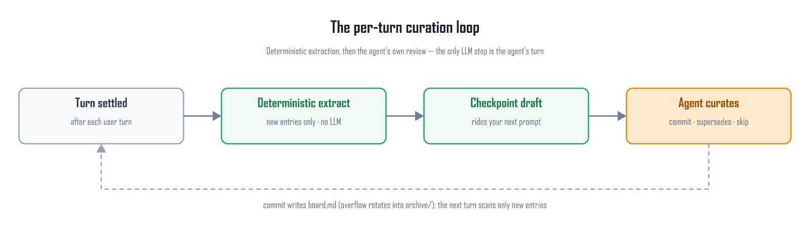
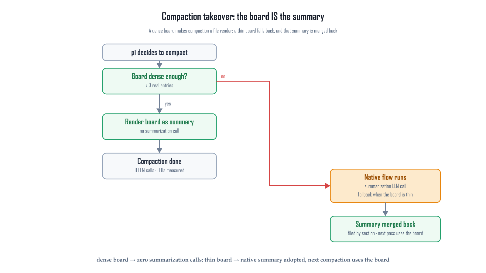

# pi-session-blackboard

**pi's compaction summary, turned from a model call into a file render.**

The extension keeps a per-session *blackboard* — a plain markdown file of curated
facts. Every turn it extracts candidate facts deterministically (pure TS, no LLM),
hands the draft to the agent for review, and writes what survives to disk. When
compaction fires, **that file is the summary**: pi's summarization call is skipped
entirely, and pi's own cut-point, retained tail and compaction entry are untouched.

> ⚠️ **Experimental.** The core path (board → summary, extraction, archival
> rotation) is covered by the smoke suite; checkpoint delivery and summary
> adoption depend on real session behaviour and have not been battle-tested
> across many long sessions. Feedback in [issues](https://github.com/113636xfh/pi-session-blackboard/issues) is welcome.
> Also read [Limitations](#limitations-the-honest-version) before relying on it.

[](https://github.com/113636xfh/pi-session-blackboard/actions/workflows/test.yml)
[](LICENSE)
中文文档: [README.zh.md](README.zh.md)

| | pi's native compaction | this extension (`"compaction": "board"`) |
|---|---|---|
| summarization model call | one per compaction | **none** |
| wall clock (one local box, W4A16 27B over PCIe) | > 3 min, did not finish | **0.0 s** |
| exact facts (paths, symbols, error text) | whatever the model kept | whatever the agent committed |
| inspectable after the fact | no | a markdown file you can `grep` |
| background LLM calls | — | **never** |

## Contents

- [Why](#why)
- [Install](#install)
- [Enable the mode that matters](#enable-the-mode-that-matters)
- [What you actually see](#what-you-actually-see)
- [How it works](#how-it-works)
- [The board](#the-board)
- [Searching past the summary](#searching-past-the-summary)
- [Where things live](#where-things-live)
- [Configuration](#configuration)
- [Cost model](#cost-model)
- [Compatibility](#compatibility)
- [Development](#development)
- [Limitations (the honest version)](#limitations-the-honest-version)
- [Acknowledgements & license](#acknowledgements--license)

## Why

pi's native compaction calls a summarization model to compress the older history
into one block of text. Two costs:

1. **It is the most expensive call in the loop.** On a local model (W4A16 27B
   over PCIe) it did not finish inside 3 minutes.
2. **It is lossy in exactly the wrong way.** File paths, function names, exact
   error text — the facts you need to keep working after the compaction — are
   the first things a prose summary drops or paraphrases.

This package does not try to write a better summary. It changes the **source of
information**: the facts are already in the session, so they are mined every
turn by deterministic code, curated by the agent itself (the only step that
needs semantic judgement — a regex cannot tell "this decision is dead" from
"this decision still holds"), and stored as one line per fact. Compaction then
renders that file.

## Install

```bash
pi install /path/to/pi-session-blackboard     # user-level; -l for project-level
# restart pi — extensions load at process start
```

Remove with `pi remove <name-as-shown-by-pi-list>`.

If you reference the package from `settings.json` → `packages`, use the **bare
string** form:

```jsonc
{ "packages": ["../../pi-session-blackboard"] }        // ✅
{ "packages": [{ "path": "../../pi-session-blackboard", "extensions": [] }] }  // ❌ disables every extension in it
```

An empty `extensions: []` means "explicitly none", not "no filter". Check with
`pi list` — a `(filtered)` marker means the extension is not loading.

## Enable the mode that matters

Out of the box the extension **assists**: native compaction still runs, and a
capped deterministic board section is appended to the LLM summary. The headline
mode is one key away — in `~/.pi/agent/settings.json` (user) or
`.pi/settings.json` (project, wins):

```jsonc
{
  "session-blackboard": {
    "compaction": "board"      // the board IS the summary; pi's summarization call is skipped
  }
}
```

Three modes:

| `compaction` | what happens at compaction |
|---|---|
| `"off"` (default) | native flow untouched; if `compactAssist` is on (default), a capped board section is appended to the LLM summary |
| `"digest"` | native flow untouched; a compact board digest is mirrored into the session JSONL first |
| `"board"` | **the board is returned as the summary** — no summarization call. A thin board (< 3 real entries) returns `null` and the native flow runs unchanged |

## What you actually see

**1. A checkpoint rides your next prompt** (hidden message, `display: false`, so
the TUI stays clean). It carries the deterministic draft, a countdown to
compaction, and one blunt instruction: *what you commit here is the summary.*

```
[session-blackboard checkpoint]
[context pressure] compaction is 3.3k away — context is at 95.0k of 131k tokens
(pi compacts above 98.3k = window − reserve 32.8k). NEAR COMPACTION — commit what
matters from this turn onto the board NOW …
The draft's deterministic lines (`MODIFIED …` / `COMMIT …`) land automatically with
your next commit — do NOT retype them; reject one with dropDraft=["substring"].
Every other draft line lands ONLY if you write it yourself in `entries`.
--- draft ---
## Files
- MODIFIED src/board.ts (commitEntries, renderCommitEcho)
- COMMIT 93c32ad 手动原生压缩按钮 /bb compact
## Issues
- [ERROR] npm test: smoke: FAIL 1/46
--- end draft ---
```

**2. The agent curates** — corrects, culls, and commits with `blackboard`:

```jsonc
{ "action": "commit", "entries": [
  { "section": "decisions", "text": "commit receipt returns only the new lines + 2 per section",
    "supersedes": "commit returns the whole board" }
], "dropDraft": ["[ERROR] npm test"] }
```

The mechanical draft does not have to be retyped: the deterministic lines
(`MODIFIED …`, `COMMIT …`) land with this same commit, marked `~` in the receipt.
The receipt itself stays small — your entries `+`, auto-accepted draft lines `~`,
each preceded by its 2 nearest older entries (enough to pick the next
`supersedes` substring):

```
Committed 3 entries (2 auto-accepted from the mechanical draft). Blackboard v7.
1 draft line did NOT land (draftOnCommit="deterministic" leaves them to you) — the draft is now cleared; rewrite them in the next commit if they matter.
Replaced entries archived → archive/<sid>/superseded-20261008-134102.md (still searchable via blackboard_recall).

Board after commit — your entries (+) and auto-accepted draft lines (~), each preceded by its 2 nearest older entries:

## Decisions — 1 new
  [2026-10-08 13:02] board mode returns the board as the summary
  [2026-10-08 13:20] supersedes must name a unique substring
+ [2026-10-08 13:41] commit receipt returns only the new lines + 2 per section

## Files — 2 new
  [2026-10-08 13:02] MODIFIED src/summary.ts (renderSummary)
  [2026-10-08 13:20] MODIFIED src/recall.ts (searchDigest)
~ [2026-10-08 13:41] MODIFIED src/board.ts (commitEntries, renderCommitEcho)
~ [2026-10-08 13:41] COMMIT 93c32ad 手动原生压缩按钮 /bb compact

Full board: ~/.pi/agent/blackboard/<sid>.md — use action="show" or blackboard_recall, do not re-read the file.
```

**3. `/bb` shows the state of play** at any time:

```
blackboard: ~/.pi/agent/blackboard/<sid>.md
v7 | updated: 2026-10-08 13:41 | entries: 22 (+3 archive pointers) | turns since checkpoint: 1 | pending draft: 4 lines
compaction: board | 3.3k tokens left until pi's native trigger
```

## How it works



Three parts, and exactly one of them involves a model:

1. **Extraction — deterministic, every turn.** Pure TS scans only the session
   entries since the last cursor: goal/scope, preferences, `MODIFIED <path>
   (symbols)` from successful `edit`/`write`, `COMMIT <hash> <subject>` from
   successful `git commit`, `[ERROR] <cmd>: <first error line>` from failed
   shells, decision/finding/next-step phrasing from assistant prose.
   Milliseconds, no network, no tuning.
2. **Review — the agent, inside its own turn.** The draft is injected with your
   next message (`delivery: "next-turn"`, zero extra API calls) or immediately
   as a steer (`"immediate"`). The agent commits the survivors or skips.
3. **Archival — mechanical.** Per-section overflow rotates into append-only
   archive files; every commit mirrors a compact digest into the session JSONL
   (`sbb-snapshot` custom entries — never in LLM context, permanently searchable).

Open issues whose referenced file was later modified get marked `[RESOLVED <ts>]`
automatically.

### Draft and commit are one call

Mechanical extraction never writes to the board by itself — it fills a **pending
draft**. What used to happen: the draft was displayed, then discarded, so a mined
fact survived only if the agent retyped it. Measured over 70 debug logs and 26
real boards: 258 turns produced **2013 draft lines**, there were 143 commits, and
the boards kept just **12** `MODIFIED`/`COMMIT` lines against 528 agent-written
ones (2.2%) — the exact facts this package exists to preserve were precisely the
ones being lost, and retyping the rest is output-token work (mean draft 7.6
lines, median 5, p90 17, max 45).

A commit now carries both halves:

| part | what it is |
|---|---|
| `entries` | what the agent writes itself — its decisions, findings, corrections |
| auto-accepted draft | `draftOnCommit: "deterministic"` (default): only the zero-heuristic extractor output, `MODIFIED <path> (symbols)` and `COMMIT <hash> <subject>` |
| `dropDraft: ["substring"]` | the draft lines the agent **rejects** — case-insensitive, no retyping |

The heuristic extractors (prose-mined decisions/findings/next, `[ERROR]` lines,
preference patterns, scope changes) deliberately stay under the agent's pen: they
are starting points and they do produce false positives. `draftOnCommit: "all"`
flips it so the whole draft lands and the agent only culls; `"none"` restores
retype-everything.

Whatever the policy, the commit clears the draft and the receipt states how many
draft lines did **not** land — the leak is visible instead of silent.

### Compaction: the board is the summary



`session_before_compact` returns:

```ts
{ compaction: { summary: renderSummary(board),   // pi's own section shape
                firstKeptEntryId, tokensBefore } }
```

- **skips** pi's summarization call rather than duplicating it;
- everything else stays pi's: cut-point, `keepRecentTokens` retained tail,
  compaction entry, projection rebuild;
- rendered in pi's native section names (`## Goal`, `## Constraints &
  Preferences`, `## Key Decisions`, `## Key Findings`, `## Files & Changes`,
  `## Open Issues`, `## Next Steps`) plus a footer: board file path, archive
  directory, and how to use `blackboard_recall`;
- **the footer is reserved before truncation** — when the board exceeds
  `summaryMaxChars`, the oldest body lines go, never the retrieval instructions;
- **a thin board never becomes a thin summary**: fewer than 3 real entries →
  `null` → untouched native flow. Read/render errors fall back the same way.

### `/bb compact`: the manual native button

One switch sends the *next* compaction through pi's own summarization even in
`"board"` mode:

1. the command arms a **one-shot** flag in the state file (5-minute TTL, so a
   cancelled compaction cannot leave a bypass lying around);
2. `session_before_compact` sees it and returns `undefined` → pi's native flow
   runs untouched (its cut-point, retained tail, retry policy);
3. `session_compact` then **merges that native summary back into the board**.

So it costs one model call and still loses nothing. To make native the permanent
choice, set `"compaction": "off"`.

### Adoption: a native summary is never wasted

Any summary pi produced by itself — from an earlier session before the extension
was enabled, or from a fallback because the board was thin — is parsed into board
entries and **merged**, oldest first, on `session_start` and on `session_compact`.
Safety comes from structure, not from refusing:

- the board's own summary is refused (marker in its title), so a board-mode
  compaction can never be parsed back into itself;
- **6 entries per section per merge** (newest kept); the rest go into a single
  `adopted-<stamp>.md`;
- exact case-insensitive dedupe against the board *and* against the archive
  files, so re-merging the same summary is a no-op.

### The countdown

Every checkpoint message carries how far compaction is, computed the way pi
computes it: `contextWindow − reserveTokens`, with `reserveTokens` resolved
model-override → project settings → user settings → pi's built-in 16384. Inside
`compactionWarnTokens` (default 32768) of that line the checkpoint switches to
**every turn** — even with an empty draft — because the next turn may be the
last one before the board becomes the summary. If the token count is unknown
(right after a compaction), no line is printed: it never fakes an alarm.

## The board

One line per fact, auto-timestamped, capped at `maxEntryChars` (300):

```markdown
## Decisions
- [2026-10-08 13:02] board mode returns the board as the summary: pi's cut-point and retained tail stay pi's
```

| Section | What lands there | Written by |
|---|---|---|
| `Goal` | the opening task; later only explicit pivots (`instead`, `actually`, `switch to`, …) as `[Scope change]` | extraction + review |
| `Decisions` | choices **and why** — the review pass is what makes these worth reading | mostly the agent |
| `Findings` | results of exploration/experiments: the measured number, the root cause, the gotcha | mostly the agent |
| `Files` | `MODIFIED <path> (exported symbols)` and `COMMIT <hash> <subject>` — auto-accepted with each commit by default | deterministic |
| `Issues` | `[ERROR] <cmd>: <first error line>`; auto-`[RESOLVED <ts>]` when the file gets fixed | extraction + review |
| `Next` | the concrete next step | extraction + review |
| `Prefs` | "always / never / prefer / please …" statements | extraction + review |
| `Archived` | pointers to archive files, extension-managed, capped at 5 per section | extension |

**A changed fact must not leave two versions on the board.** `commit` only
dedupes exact matches, so editing a fact without `supersedes` leaves the stale
line next to the new one — and the summary would carry both. `supersedes` names a
unique substring of the line being replaced: it is archived in the same call
(one file per commit, still recallable), a pointer line records it, and the new
line becomes the only version the summary can show. An ambiguous or missing
target is reported (the new line still lands) so the agent can retry with a
longer substring.

## Searching past the summary

Once the board *is* the summary, the model needs a way to dig below it.
`blackboard_recall` greps, case-insensitively, in order: the live board → the
archive files (newest first, up to 40) → the mirrored `sbb-snapshot` digests.

The query is a **literal substring copied out of the conversation** (a path, an
identifier, an error fragment), not a natural-language question. One line per
hit, attributed to where it came from, newest last:

```
blackboard recall — 3 match(es) for "reserveTokens" (newest last):
- [board · Decisions] - [2026-10-08 13:02] the countdown mirrors pi's reserve resolution …
- [archive/board-20261002-064611220-0005.md · From: Goal] - [2026-10-02 14:46] …
- [snapshot/2291@07-11-24 · Goal] main line: …
```

Digest hits are attributed to the board section the line came from (`recentFiles`
reports `Files`); numbers and the `counts` object are skipped — matching a count
is noise, not a fact. `full: true` dumps whole snapshots when you want the board
state rather than a single fact.

## Where things live

You never manage these. The board is written only by the `blackboard` tool when
the agent commits:

| Path | Written by | Contents |
|---|---|---|
| `<boardDir>/<sessionId>.md` | `blackboard` tool (commit) | **the board** — plain markdown, stable section order, per-section budget |
| `<boardDir>/archive/<sessionId>/board-<stamp>.md` | rotation | one file per overflow rotation, append-only |
| `<boardDir>/archive/<sessionId>/superseded-<stamp>.md` | `supersedes` | one file per commit's replaced entries |
| `<boardDir>/archive/<sessionId>/adopted-<stamp>.md` | adoption | entries beyond the per-merge budget |
| `<boardDir>/state/<sessionId>.json` | extension | extraction cursor, pending draft, counters (atomic tmp+rename) |
| `<boardDir>/debug/<sessionId>.ndjson` | extension, only with `"debugLog": true` | event log |
| session JSONL (`sbb-snapshot`) | extension, `mirrorToSession` | compact digest, searchable by recall |

Default `<boardDir>` is `<pi agent dir>/blackboard`. State, drafts, mirrors and
digests **never enter the model context** — they are files and JSONL custom
entries: greppable, committable, readable with the normal `read` tool (e.g.
after a compaction).

## Configuration

Key `"session-blackboard"` in `~/.pi/agent/settings.json` (user) or
`.pi/settings.json` (project, wins per key):

```jsonc
{
  "session-blackboard": {
    "enabled": true,
    "checkpointTurns": 1,
    "delivery": "next-turn",
    "compaction": "off",
    "compactionWarnTokens": 32768,
    "maxEntriesPerSection": 40,
    "maxEntryChars": 300,
    "maxDraftLines": 60,
    "draftOnCommit": "deterministic",
    "commitContextEntries": 2,
    "summaryMaxChars": 6000,
    "compactAssist": true,
    "compactAssistMaxChars": 4000,
    "seedFromPriorSummary": true,
    "mirrorToSession": true,
    "boardDir": "~/.pi/agent/blackboard",
    "debugLog": false
  }
}
```

| Key | Default | Notes |
|---|---|---|
| `enabled` | `true` | master switch; `false` also *de-activates* the tool (pi auto-activates extension tools) |
| `checkpointTurns` | `1` | review cadence in user turns. Extraction and `[RESOLVED]` marking still run every turn. Raise to 3–10 if the review cadence feels heavy |
| `delivery` | `"next-turn"` | `"next-turn"`: the draft rides your next message (zero extra LLM calls). `"immediate"`: a steer message triggers a review turn now — useful for unattended runs where the next user message is far away |
| `compaction` | `"off"` | `"board"` is the mode this package exists for — see [Enable the mode that matters](#enable-the-mode-that-matters) |
| `compactionWarnTokens` | `32768` | near-compaction zone in tokens left; inside it the checkpoint fires every turn with a countdown. `0` disables |
| `maxEntriesPerSection` | `40` | per-section budget before rotation |
| `maxEntryChars` | `300` | per-entry cap (adopted foreign summaries get 600 — a hard cut mid-rationale loses the part that matters) |
| `maxDraftLines` | `60` | draft size rendered into a checkpoint message |
| `draftOnCommit` | `"deterministic"` | which draft lines land with a commit without being retyped: `"none"` / `"deterministic"` (`MODIFIED`+`COMMIT` only) / `"all"` (agent culls with `dropDraft`) |
| `commitContextEntries` | `2` | how many older entries per section a commit echoes back next to the new ones. `0` = only the new ones |
| `summaryMaxChars` | `6000` | hard cap for the board rendered as the summary (footer reserved first) |
| `compactAssist` / `compactAssistMaxChars` | `true` / `4000` | legacy assist path (see below) |
| `seedFromPriorSummary` | `true` | merge native summaries into the board |
| `mirrorToSession` | `true` | append the compact digest to the session JSONL |
| `boardDir` | `<agent dir>/blackboard` | absolute, or relative to the pi agent dir |
| `debugLog` | `false` | ndjson event log — the fastest way to see which hooks actually fired |

### Legacy: compaction assist

`compactAssist` (on by default, irrelevant once `compaction: "board"`) calls the
*same* exported `compact()` the harness would call — same model, prompt,
retained tail — and appends a capped deterministic board section (goal ≤ 3, open
issues ≤ 5, files ≤ 5, next ≤ 3, per-section stats, pointers to the board file
and archive directory). Every failure path returns `undefined`, so the native
flow runs untouched with its own retry policy.

## Cost model

| Workload | This extension |
|---|---|
| background LLM calls | **never** |
| extra prefill | none (extraction is pure CPU) |
| prompt overhead | the checkpoint message (~1–3k tokens, appended at the end, so the prefix cache survives) + the small commit receipt; the auto-accepted draft lines cost **no** agent output tokens |
| archival | deterministic file rotation |
| compaction | `"board"`: render the board, skip pi's summarization call (thin board → native). `"off"`/`"digest"`: native, optionally with an appended section / mirrored digest |

## Compatibility

- pi ≥ 0.84 (developed against the 0.84.x extension API: `agent_settled`,
  `before_agent_start`, `session_before_compact`, `session_compact`,
  `session_start`, `pi.registerTool`, `pi.registerCommand`, `pi.appendEntry`,
  `pi.sendMessage`).
- **Zero runtime dependencies** — only `node:*`, `typebox` and
  `@earendil-works/pi-coding-agent`, all resolved by pi's extension loader.
- TypeScript strict; `npm install && npm run typecheck`.

## Development

```bash
npm install          # devDependencies only; the extension itself has none
npm run typecheck    # tsc --noEmit
npm test             # build (tsc → build/) + node test/smoke.mjs   (54 checks)
npm run docs:render  # SVG → PNG via resvg (deterministic, no browser)
```

The smoke suite asserts the pure functions that decide what the model sees
after a compaction: board → summary rendering, recall search, commit +
supersedes + rotation + pointer caps, adoption parsing, the countdown math, the
legacy assist section. Hooks, checkpoint injection and the compaction handover
are exercised in real pi sessions, not in the suite.

Diagram sources are `docs/src/*.svg` (`-en` / `-zh` pairs); the committed PNGs
in `docs/images/` are what GitHub renders.

> **A `&` in the repo path breaks npm scripts on Windows.** npm resolves the
> `node_modules\.bin` shims to an absolute path containing `&`, cmd.exe treats
> it as a command separator, and you get `'D:\…\node_modules\.bin\' is not
> recognized`. That is why `build`/`typecheck` call
> `node ./node_modules/typescript/bin/tsc` instead of bare `tsc`.

`tsconfig.json` is the portable config. `tsconfig.check.json` /
`tsconfig.build.json` are local helpers (they map `@earendil-works/*` and
`typebox` to whatever is installed on this machine) and are git-ignored on
purpose.

## Limitations (the honest version)

- **Curation is prompt-enforced, not guaranteed.** The model can ignore a
  checkpoint. Mitigations: at most 3 re-injections plus a visible warning, and a
  fresh trigger on the next user turn. Near-compaction nudges do not consume
  that budget.
- **Assistant-text mining (decisions/next/findings) is deliberately light and
  capped.** It is a starting point for the review pass, not a source of truth.
- **Auto-accepted `Files` lines are not reviewed.** They come from tool arguments
  (which file, which exported symbol, which commit hash), so they are exact — but
  "exact" is not "relevant": a session that touches 30 files gets 30 lines. Set
  `draftOnCommit: "none"` if you want every line to pass through the agent.
- **The `[ERROR]` extractor is a heuristic over raw tool output** and does
  produce false positives — observed: an `[ERROR]` line echoed inside test
  output, and a `grep -c` with zero matches (exit code 1) on a run that actually
  passed. The review step is the mitigation; extraction will keep making
  mistakes like these.
- **`[Scope change]` detection needs explicit pivot language.** Tightened after
  measuring that a task-verb rule fired on 4 of 5 ordinary follow-up messages;
  the cost is that a quiet change of direction is only caught by the agent.
- **Per-session boards.** A finished session's board is a file you can keep,
  grep or delete; `/bb reset` only touches the current session.
- **No cross-session recall.** `blackboard_recall` covers this session's live
  board, its archive and its mirrored digests. For anything older, grep the
  `blackboard/` directory yourself.
- **`blackboard_recall` reads at most the 40 newest archive files** and says so
  when it capped. Very long sessions should grep the archive directory instead.
- **The summary is only as good as the board.** A session that never commits
  gets a thin board, and a thin board deliberately falls back to pi's native
  summarization rather than produce a useless summary.

## Acknowledgements & license

Goal/scope-change and preference patterns are adapted from
**[@monotykamary/pi-vcc](https://github.com/monotykamary/pi-vcc)** (MIT). The
"deterministic extraction + agent-curated commits + board-as-summary" design is
this package's.

MIT — see [LICENSE](./LICENSE). Changes: [CHANGELOG.md](CHANGELOG.md).
