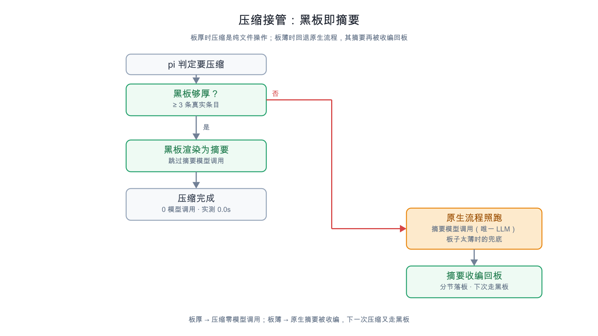

# pi-session-blackboard

**把 pi 的压缩摘要从「模型调用」变成「文件渲染」。**

扩展为每个会话维护一块*黑板*——一个纯 markdown 文件，里面是审校过的事实。每个回合
用纯 TS 确定性抽取候选事实（零模型），草稿交给代理自己审校，落盘成一行一条事实。
压缩触发时，**这个文件就是摘要**：pi 的摘要模型调用被整个跳过，而 pi 自己的切点算法、
保留尾部、compaction entry 全部不变。

> ⚠️ **实验性项目。** 核心路径（板→摘要、抽取、归档轮转）有 smoke 测试覆盖；
> checkpoint 投递和摘要收编依赖真实会话行为，尚未经过多会话长时间验证。
> 欢迎在 [issues](https://github.com/113636xfh/pi-session-blackboard/issues) 反馈。
> 用之前请先读[局限](#局限诚实版)。

[](https://github.com/113636xfh/pi-session-blackboard/actions/workflows/test.yml)
[](LICENSE)
English: [README.md](README.md)

| | pi 原生压缩 | 本扩展（`"compaction": "board"`） |
|---|---|---|
| 摘要模型调用 | 每次压缩一次 | **零次** |
| 耗时（同一台本地机，W4A16 27B over PCIe） | > 3 分钟未跑完 | **0.0 秒** |
| 精确事实（路径、符号、报错原文） | 模型留下什么算什么 | 代理 commit 了什么就是什么 |
| 事后能否检查 | 不能 | 一个可以 `grep` 的 markdown 文件 |
| 后台 LLM 调用 | — | **永不** |

## 目录

- [为什么](#为什么)
- [安装](#安装)
- [打开真正有用的模式](#打开真正有用的模式)
- [实际会看到什么](#实际会看到什么)
- [怎么工作的](#怎么工作的)
- [黑板长什么样](#黑板长什么样)
- [越过摘要往回找](#越过摘要往回找)
- [东西落在哪里](#东西落在哪里)
- [配置](#配置)
- [成本模型](#成本模型)
- [兼容性](#兼容性)
- [开发](#开发)
- [局限（诚实版）](#局限诚实版)
- [致谢与许可](#致谢与许可)

## 为什么

pi 的原生压缩会调用摘要模型，把旧历史压成一段文本。两个代价：

1. **它是整条循环里最贵的一次调用。** 本地模型（W4A16 27B over PCIe）上 3 分钟内
   跑不完。
2. **它恰好在最不该丢的地方丢。** 文件路径、函数名、报错原文——压缩之后继续干活
   最需要的东西——正是散文摘要最先丢掉或改写的。

本包不做「更好的摘要」，而是换**信息源**：事实本来就在会话里，所以每回合由确定性
代码挖出来，由代理自己审校（唯一需要语义判断的环节——正则分不出「这个决策已死」
和「这个决策还有效」），一行一条落盘。压缩时把这个文件渲染成摘要。

## 安装

```bash
pi install /path/to/pi-session-blackboard     # 用户级；-l 为项目级
# 重启 pi —— 扩展在进程启动时加载
```

移除：`pi remove <pi list 显示的名字>`。

如果在 `settings.json` 的 `packages` 里引用本包，必须用**裸字符串**形式：

```jsonc
{ "packages": ["../../pi-session-blackboard"] }        // ✅
{ "packages": [{ "path": "../../pi-session-blackboard", "extensions": [] }] }  // ❌ 会禁用该包全部扩展
```

空数组 `extensions: []` 的含义是「显式不要任何扩展」，不是「不筛选」。
用 `pi list` 检查，出现 `(filtered)` 标记就说明没加载上。

## 打开真正有用的模式

默认情况下本扩展只做**辅助**：原生压缩照跑，只是在 LLM 摘要末尾追加一节的限量板
摘要。真正的主角是一个开关——在 `~/.pi/agent/settings.json`（用户）或
`.pi/settings.json`（项目，优先）：

```jsonc
{
  "session-blackboard": {
    "compaction": "board"      // 板即摘要；pi 的摘要调用被跳过
  }
}
```

三种模式：

| `compaction` | 压缩时发生什么 |
|---|---|
| `"off"`（默认） | 原生流程原样跑；`compactAssist` 开着（默认）时在 LLM 摘要末尾追加限量板节 |
| `"digest"` | 原生流程原样跑；先把紧凑板 digest 镜像进会话 JSONL |
| `"board"` | **板作为摘要返回**——不调用摘要模型。薄板（真实条目 < 3）返回 `null`，原生流程原样跑 |

## 实际会看到什么

**1. 一条 checkpoint 搭在你的下一条提示上**（隐藏消息，`display: false`，TUI 保持
干净）。它带确定性草稿、距压缩的倒计时，以及一句直白的提示：*你在这里 commit 的
就是摘要。*

```
[session-blackboard checkpoint]
[context pressure] compaction is 3.3k away — context is at 95.0k of 131k tokens
(pi compacts above 98.3k = window − reserve 32.8k). NEAR COMPACTION — commit what
matters from this turn onto the board NOW …
--- draft ---
## Files
- MODIFIED src/board.ts (commitEntries, renderCommitEcho)
- COMMIT 93c32ad 手动原生压缩按钮 /bb compact
## Issues
- [ERROR] npm test: smoke: FAIL 1/46
--- end draft ---
```

**2. 代理自己审校**——改正、删噪，然后用 `blackboard` 提交：

```jsonc
{ "action": "commit", "entries": [
  { "section": "decisions", "text": "commit 回执只返回新行 + 每节 2 条上下文",
    "supersedes": "commit 返回整块板" }
]}
```

回执刻意做得很小——你的条目用 `+` 标出，前面是同节最近的 2 条（足够挑下一个
`supersedes` 的目标子串）：

```
Committed 1 entry. Blackboard v7.
Replaced entries archived → archive/<sid>/superseded-20261008-134102.md (still searchable via blackboard_recall).

Board after commit — your entries (+), each preceded by its 2 nearest older entries:

## Decisions — 1 new
  [2026-10-08 13:02] board 模式把板作为摘要返回：pi 的切点和保留尾部仍是 pi 的
  [2026-10-08 13:20] supersedes 必须给唯一子串
+ [2026-10-08 13:41] commit 回执只返回新行 + 每节 2 条上下文

Full board: ~/.pi/agent/blackboard/<sid>.md — use action="show" or blackboard_recall, do not re-read the file.
```

**3. `/bb` 随时看状态：**

```
blackboard: ~/.pi/agent/blackboard/<sid>.md
v7 | updated: 2026-10-08 13:41 | entries: 22 (+3 archive pointers) | turns since checkpoint: 1 | pending draft: 4 lines
compaction: board | 3.3k tokens left until pi's native trigger
```

## 怎么工作的


三个部件，其中只有一个涉及模型：

1. **抽取——确定性，每回合。** 纯 TS 只扫游标之后的*新增*会话条目：goal/scope、
   偏好、成功 `edit`/`write` 产生的 `MODIFIED <path> (导出符号)`、成功
   `git commit` 产生的 `COMMIT <hash> <subject>`、失败 shell 的
   `[ERROR] <cmd>: <首行报错>`、助手文本里的 decision/finding/next 句式。
   毫秒级，无网络，无调参。
2. **审校——代理自己，在它自己的回合里。** 草稿随你下一条消息注入
   （`delivery: "next-turn"`，零额外 API 调用），或以 steer 消息立即触发
   （`"immediate"`）。代理审校后 commit 幸存者，或者 skip。
3. **归档——机械。** 每节溢出确定性轮转进 append-only 归档文件；每次 commit 都把
   紧凑 digest 镜像进会话 JSONL（`sbb-snapshot` custom entry——永不进入 LLM 上下文，
   永久可搜）。

开放 issue 引用的文件后来被改过，会自动标 `[RESOLVED <ts>]`。

### 压缩：板即摘要



`session_before_compact` 返回：

```ts
{ compaction: { summary: renderSummary(board),   // pi 自己的分节形状
                firstKeptEntryId, tokensBefore } }
```

- 是**跳过**pi 的摘要调用，而不是复制一次；
- 其余全是 pi 的：切点、`keepRecentTokens` 保留尾部、compaction entry、投影重建；
- 按 pi 原生摘要的分节名渲染（`## Goal`、`## Constraints & Preferences`、
  `## Key Decisions`、`## Key Findings`、`## Files & Changes`、`## Open Issues`、
  `## Next Steps`），外加页脚：板文件路径 + 归档目录 + `blackboard_recall` 用法；
- **页脚先预留再截断**：板超过 `summaryMaxChars` 时丢最老的正文行，检索指引永不丢；
- **薄板不会变成薄摘要**：真实条目 < 3 → 返回 `null` → 原生流程原样跑。
  读取/渲染异常同样回退。

### `/bb compact`：手动原生压缩按钮

一个开关让**下一次**压缩走 pi 自己的摘要，即便当前是 `"board"` 模式：

1. 命令在 state 文件里埋一个**一次性**标记（5 分钟 TTL——取消压缩不会留下过期旁路）；
2. `session_before_compact` 看到它就返回 `undefined` → pi 原生流程原样跑
   （切点、保留尾部、重试策略都是 pi 的）；
3. 然后 `session_compact` 把那份原生摘要**合并回黑板**。

所以这一次会花一次模型调用，但不会丢东西。想永久走原生，把配置改成
`"compaction": "off"`。

### 收编：原生摘要不浪费

pi 自己产生的任何摘要——启用扩展之前的旧会话历史，或因板薄而回退时产生的——都会被
解析成板条目并**合并**进来，按时间顺序，在 `session_start` 和 `session_compact` 两个
触发点。安全性靠结构而不是拒绝：

- 自己生成的摘要一律拒绝（标题里有标记），所以板模式压缩不会把自己解析回自己；
- **每次合并每节最多 6 条**（留最新），超出部分进**单个** `adopted-<stamp>.md`；
- 大小写不敏感的精确去重，板上的和归档文件里的行都算已知，所以重复合并是 no-op。

### 倒计时

每条 checkpoint 消息都带距压缩还有多远，算法与 pi 一致：`contextWindow − reserveTokens`，
`reserveTokens` 按 model override → 项目设置 → 用户设置 → pi 内置 16384 依次解析。
剩余进入 `compactionWarnTokens`（默认 32768）之后，checkpoint 改为**每回合**投递——
草稿为空也照样提醒——因为下一回合可能就是板变成摘要之前的最后一回合。
token 数未知时（刚压缩完、下一条回复还没来）不打印任何行：不编造警报。

## 黑板长什么样

一行一条事实，自动打时间戳，上限 `maxEntryChars`（300）：

```markdown
## Decisions
- [2026-10-08 13:02] board 模式把板作为摘要返回：pi 的切点和保留尾部仍是 pi 的
```

| 节 | 里面放什么 | 谁写 |
|---|---|---|
| `Goal` | 开场任务；之后只收显式转向（`instead`、`actually`、`switch to`…）的 `[Scope change]` | 抽取 + 审校 |
| `Decisions` | 选择**和理由**——审校环节决定它值不值得读 | 代理为主 |
| `Findings` | 探索/实验的结论：实测数字、根因、坑 | 代理为主 |
| `Files` | `MODIFIED <path> (导出符号)` 和 `COMMIT <hash> <subject>` | 确定性 |
| `Issues` | `[ERROR] <cmd>: <首行报错>`；文件被修好时自动 `[RESOLVED <ts>]` | 抽取 + 审校 |
| `Next` | 具体的下一步 | 抽取 + 审校 |
| `Prefs` | 「always / never / prefer / 请用…」类表述 | 抽取 + 审校 |
| `Archived` | 归档文件指针，扩展管理，每节最多 5 行 | 扩展 |

**事实变了，板上不能留两个版本。** `commit` 只在精确匹配时去重，所以改一条而不带
`supersedes`，旧行会留在新行旁边——摘要就会同时携带两版。`supersedes` 给出被替换行的
唯一子串：旧行在同一次调用里归档（一次 commit 一个文件，仍可 recall），`## Archived`
落一行指针，新行成为摘要能显示的唯一版本。目标歧义或找不到都会回报（新行照样落），
代理可以用更长子串重试。

## 越过摘要往回找

板即摘要之后，模型需要能挖到摘要之下。`blackboard_recall` 大小写不敏感地依次搜：
活板 → 归档文件（新到老，最多 40 个）→ 镜像的 `sbb-snapshot` digest。

查询是**从对话里抄出来的字面子串**（路径、标识符、报错片段），不是自然语言问题。
每条命中一行，带来源定位，最新在后：

```
blackboard recall — 3 match(es) for "reserveTokens" (newest last):
- [board · Decisions] - [2026-10-08 13:02] 倒计时镜像 pi 的 reserve 解析 …
- [archive/board-20261002-064611220-0005.md · From: Goal] - [2026-10-02 14:46] …
- [snapshot/2291@07-11-24 · Goal] 主线：…
```

digest 的命中会归属到它来自哪个板节（`recentFiles` 报 `Files`）；数字和 `counts`
对象跳过——匹配计数是噪声不是事实。`full: true` 输出整块 snapshot（要的是板状态
而不是单条事实时）。

## 东西落在哪里

这些你从不需要管理。板只由 `blackboard` 工具在代理 commit 时写：

| 路径 | 谁写 | 内容 |
|---|---|---|
| `<boardDir>/<sessionId>.md` | `blackboard` 工具（commit） | **板** —— 纯 markdown，分节顺序稳定，每节有上限 |
| `<boardDir>/archive/<sessionId>/board-<stamp>.md` | 轮转 | 每次溢出一个文件，append-only |
| `<boardDir>/archive/<sessionId>/superseded-<stamp>.md` | `supersedes` | 一次 commit 里被替换的条目 |
| `<boardDir>/archive/<sessionId>/adopted-<stamp>.md` | 收编 | 超出每次合并额度的条目 |
| `<boardDir>/state/<sessionId>.json` | 扩展 | 抽取游标、待审草稿、计数器（tmp+rename 原子写） |
| `<boardDir>/debug/<sessionId>.ndjson` | 扩展，仅 `"debugLog": true` | 事件日志 |
| 会话 JSONL（`sbb-snapshot`） | 扩展，`mirrorToSession` | 紧凑 digest，recall 可搜 |

默认 `<boardDir>` 是 `<pi agent dir>/blackboard`。状态、草稿、镜像、digest
**永不进入模型上下文**：它们是文件和 JSONL custom entry——可 grep、可 commit、
可以用普通 `read` 工具读（例如压缩之后）。

## 配置

`~/.pi/agent/settings.json`（用户）或 `.pi/settings.json`（项目，逐键覆盖）里的
`"session-blackboard"`：

```jsonc
{
  "session-blackboard": {
    "enabled": true,
    "checkpointTurns": 1,
    "delivery": "next-turn",
    "compaction": "off",
    "compactionWarnTokens": 32768,
    "maxEntriesPerSection": 40,
    "maxEntryChars": 300,
    "maxDraftLines": 60,
    "commitContextEntries": 2,
    "summaryMaxChars": 6000,
    "compactAssist": true,
    "compactAssistMaxChars": 4000,
    "seedFromPriorSummary": true,
    "mirrorToSession": true,
    "boardDir": "~/.pi/agent/blackboard",
    "debugLog": false
  }
}
```

| 键 | 默认 | 说明 |
|---|---|---|
| `enabled` | `true` | 主开关；`false` 还会主动**停用**工具（pi 会自动激活扩展注册的工具） |
| `checkpointTurns` | `1` | 审校节奏（用户回合数）。抽取和 `[RESOLVED]` 标记仍每回合跑。嫌吵调到 3–10 |
| `delivery` | `"next-turn"` | `"next-turn"`：草稿随下一条消息注入（零额外 LLM 调用）。`"immediate"`：立即派发 steer 触发一轮审校——适合「下一条用户消息」还很远的无人值守运行 |
| `compaction` | `"off"` | `"board"` 才是本包存在的理由——见[打开真正有用的模式](#打开真正有用的模式) |
| `compactionWarnTokens` | `32768` | 距压缩低于此 token 数即进入临近区（每回合投递 + 倒计时）。`0` 关闭 |
| `maxEntriesPerSection` | `40` | 每节轮转阈值 |
| `maxEntryChars` | `300` | 每条上限（收编外来摘要时放宽到 600——硬切在理由中间会丢掉关键部分） |
| `maxDraftLines` | `60` | checkpoint 渲染的草稿大小上限 |
| `commitContextEntries` | `2` | commit 回执里每节回带多少条旧行做上下文。`0` = 只回新行 |
| `summaryMaxChars` | 6000 | 板渲染为摘要的硬上限（页脚先预留） |
| `compactAssist` / `compactAssistMaxChars` | `true` / `4000` | legacy 辅助路径（见下） |
| `seedFromPriorSummary` | `true` | 把原生摘要合并进板 |
| `mirrorToSession` | `true` | 紧凑 digest 追加进会话 JSONL |
| `boardDir` | `<agent dir>/blackboard` | 绝对路径，或相对 pi agent 目录 |
| `debugLog` | `false` | ndjson 事件日志——看哪些钩子真的跑过，这是最快的办法 |

### Legacy：compaction assist

`compactAssist`（默认开；一旦 `"compaction": "board"` 就无关）调用 harness 会调用的
*同一个*导出 `compact()`（相同模型、prompt、保留尾部），并在末尾追加一节的限量确定性
板节（goal ≤3、开放 issues ≤5、files ≤5、next ≤3、各节统计、板文件与归档目录指针）。
所有失败分支都返回 `undefined`：原生流程原样跑，用它自己的重试策略。

## 成本模型

| 工作负载 | 本扩展 |
|---|---|
| 后台 LLM 调用 | **永远没有** |
| 额外 prefill | 无（抽取纯 CPU） |
| prompt 开销 | checkpoint 消息（~1–3k tokens，追加在尾部，前缀缓存完好）+ 很小的 commit 回执 |
| 归档 | 确定性文件轮转 |
| 压缩 | `"board"`：渲染板作为摘要，跳过 pi 的摘要调用（薄板 → 原生）；`"off"`/`"digest"`：原生，可选追加节 / 镜像 digest |

## 兼容性

- pi ≥ 0.84（按 0.84.x 扩展 API 开发：`agent_settled`、`before_agent_start`、
  `session_before_compact`、`session_compact`、`session_start`、`pi.registerTool`、
  `pi.registerCommand`、`pi.appendEntry`、`pi.sendMessage`）。
- **零运行时依赖**——只 import `node:*`、`typebox`、`@earendil-works/pi-coding-agent`，
  全部由 pi 的扩展加载器解析。
- TypeScript strict；`npm install && npm run typecheck`。

## 开发

```bash
npm install          # 只有 devDependencies；扩展本身零运行时依赖
npm run typecheck    # tsc --noEmit
npm test             # build (tsc → build/) + node test/smoke.mjs   （50 项断言）
npm run docs:render  # SVG → PNG（resvg，确定性，无浏览器）
```

smoke 套件断言的是决定「压缩后模型看到什么」的纯函数：板→摘要渲染、recall 搜索、
commit + supersedes + 轮转 + 指针上限、收编解析、倒计时数学、legacy assist 节。
钩子、checkpoint 注入、压缩交接由真实 pi 会话验证，不在套件里。

图源在 `docs/src/*.svg`（`-en` / `-zh` 成对）；GitHub 渲染的是提交进仓库的
`docs/images/` PNG。

> **仓库路径里带 `&` 会让 Windows 上的 npm 脚本失败。** npm 把
> `node_modules\.bin` 里的 shim 解析成含 `&` 的绝对路径，cmd.exe 把它当命令分隔符，
> 于是报 `'D:\…\node_modules\.bin\' is not recognized`。所以 `build`/`typecheck`
> 走 `node ./node_modules/typescript/bin/tsc`，而不是裸 `tsc`。

`tsconfig.json` 是便携配置。`tsconfig.check.json` / `tsconfig.build.json` 是本机助手
（把 `@earendil-works/*` 和 `typebox` 映射到现成安装），故意 git-ignore。

## 局限（诚实版）

- **审校是 prompt 强制，不是硬保证。** 模型可以忽略 checkpoint。缓解：最多重注 3 次
  + 可见警告；下个用户回合重新触发。临近压缩的提醒不消耗这 3 次额度。
- **助手文本挖掘（decisions/next/findings）故意轻且限量。** 它是审校的起点，不是
  事实源。
- **`[ERROR]` 抽取器是对原始工具输出的启发式，确实会误报。** 实测过：测试输出里回显的
  `[ERROR]` 行；`grep -c` 零匹配导致退出码 1（测试其实*通过*了）。审校环节是缓解手段；
  抽取会继续犯这类错。
- **`[Scope change]` 需要显式转向词。** 实测「含任务动词就算转向」的旧规则在 5 条普通
  跟进消息里命中 4 条，所以收紧了；代价是安静的方向变化只能靠代理兜住。
- **每个 session id 一块板。** 会话结束后板是可保留/可 grep/可删的文件
  （`/bb reset` 只碰当前会话）。
- **无跨会话召回。** `blackboard_recall` 覆盖的是本会话的活板 + 归档 + 镜像 digest。
  更早的东西请自己 grep `blackboard/` 目录。
- **`blackboard_recall` 最多读 40 个最新归档文件**，超出会在结果里说明。超长会话
  应该直接 grep 归档目录。
- **摘要的好坏等于板的好坏。** 从不 commit 的会话只会有一块薄板，而薄板会故意回退到
  pi 的原生摘要，而不是产出一份没用的摘要。

## 致谢与许可

Goal/scope-change 与偏好抽取模式改编自
**[@monotykamary/pi-vcc](https://github.com/monotykamary/pi-vcc)**（MIT）。
「确定性抽取 + 代理审校 + 板即摘要」的设计是本包的。

MIT — 见 [LICENSE](./LICENSE)。变更：[CHANGELOG.md](CHANGELOG.md)。
